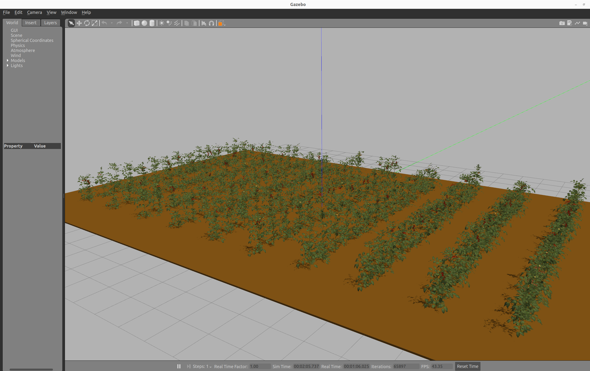
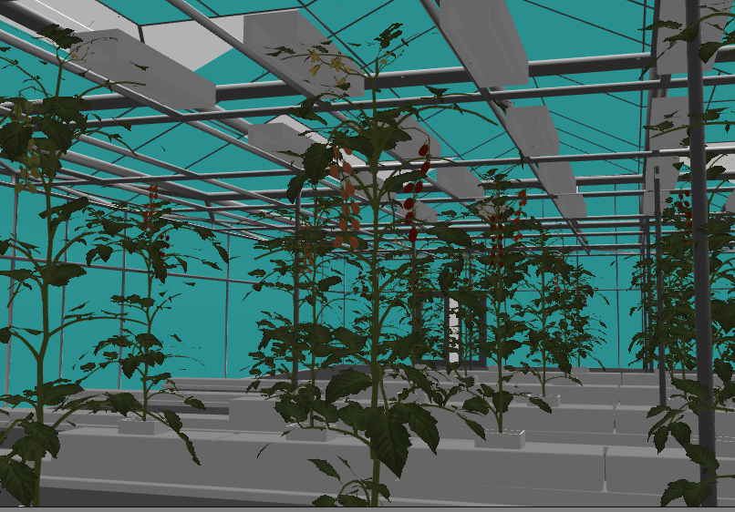
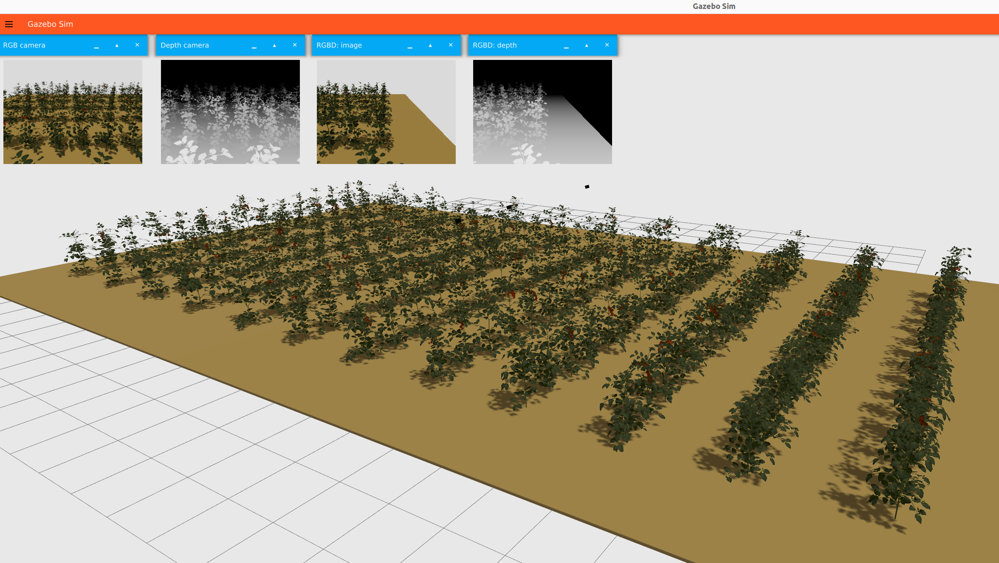
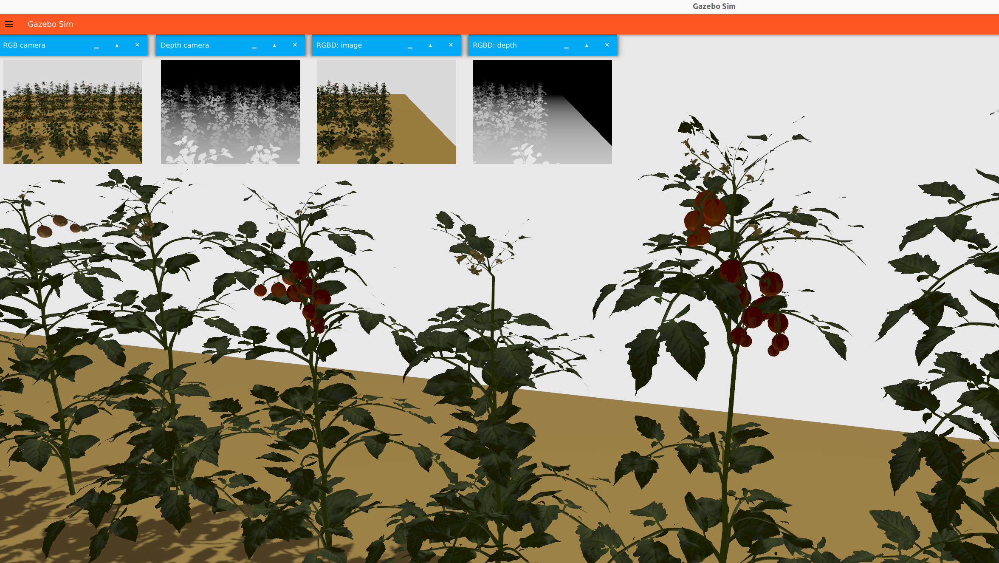

# Tomato Farm Environment
This package is a tomato farm simulator compatible with both Gazebo Sim and Gazebo Classic in ROS2 for ROS-based agricultural environments. This repository consists of two key parts

1) Random tomato farm generator
2) Simulation of the generated tomato farms in Gazebo Classic and Gazebo Sim

Gazebo Classic 

 

<!-- 
-->

Gazebo Sim

<!-- 
-->

 

# Attention!!!

**Follow instructions to build docker container to prepare environment**

https://github.com/LCAS/dogtooth_docker.git

## Getting Started (assume that you are inside the docker container)

```bash
mkdir -p /home/developer/dogtooth_ws/src 
cd /home/developer/dogtooth_ws/src
git clone --branch humble-dev git@github.com:LCAS/aoc_tomato_farm.git
cd aoc_tomato_farm && git checkout humble-dev
cd /home/developer/dogtooth_ws && colcon build
source ~/.bashrc
```

# How to Generate a New Tomato Farm

Run Jupyter Notebook

```bash
cd /home/developer/dogtooth_ws/src/aoc_tomato_farm/tomato_farm_generator/scripts/
jupyter notebook tomato_gen_Gazebo_Sim_and_Classic.ipynb
```

In this file, the farm size, the number of rows, the number of plants in each row, the distance between each plant and each row can be parametrically adjusted. Each plant in the farm is generated randomly, including locations of stems, leaves, fruits and so on. The generated tomato farm tomato models and world files, both compatible with Gazebo Sim and Gazebo Classic are saved in **tomato_farm_generator/generated** folder. 

# How to Use Generated Tomato Farms in Simulation

To use a generated tomato farm in simulation, copy files in **tomato_farm_generator/generated** folder into **tomato_farm_simulator/models** and **tomato_farm_simulator/worlds** folders and modify launch file (tomato_farm_world.launch.py) accordingly.

## Run Gazebo Simulation

Run the following launch file to simulate only Gazebo tomato farm world

```bash
ros2 launch tomato_farm_simulator tomato_farm_world.launch.py
```

