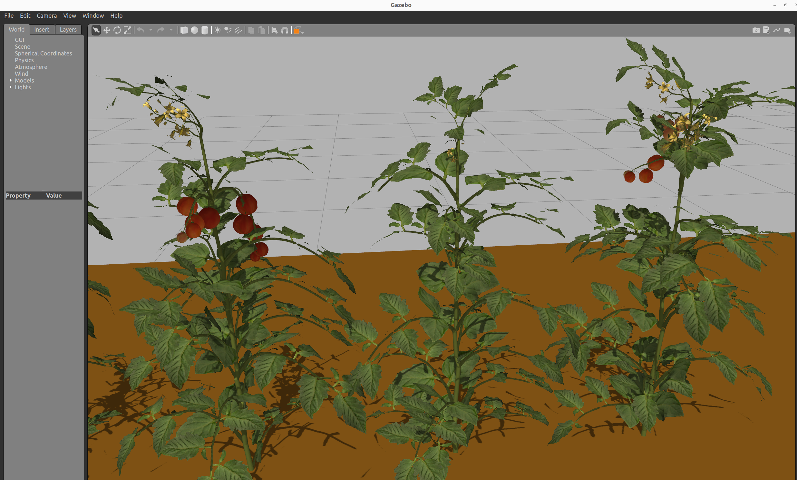
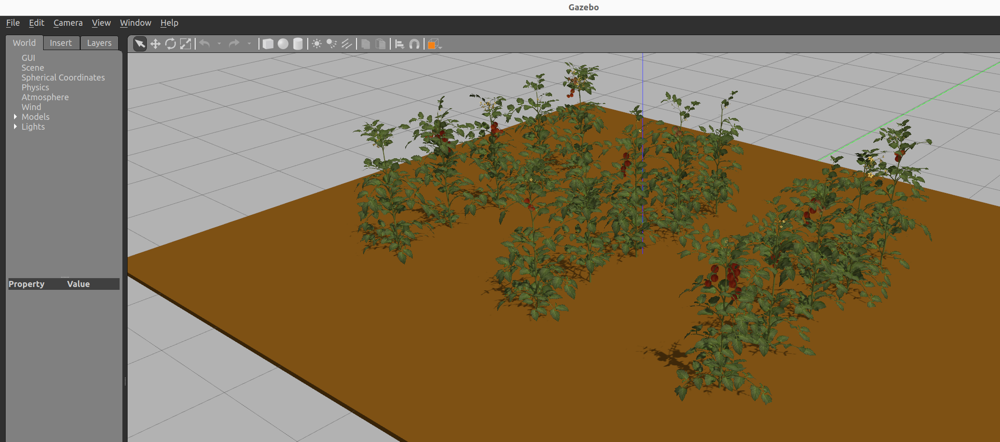
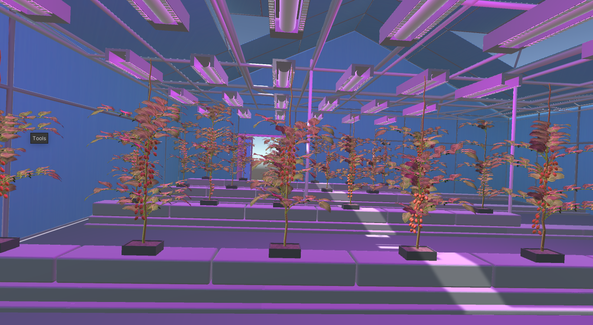
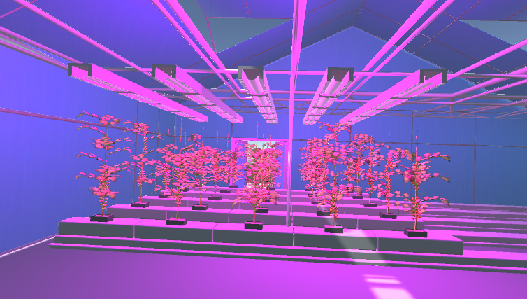
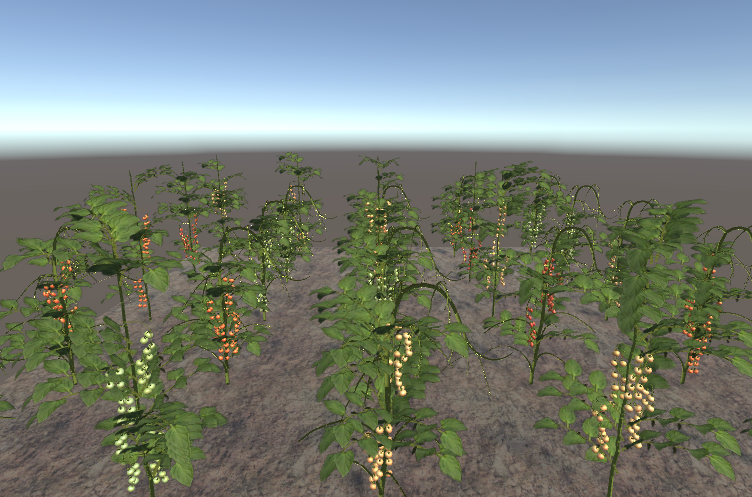
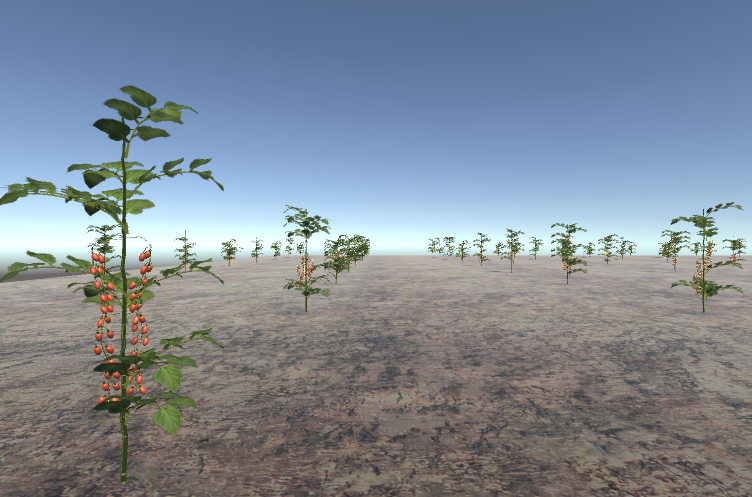

# Tomato Farm/Glasshouse Generator/Simulator

This package is a tomato farm/glasshouse generator/simulator compatible with both **Gazebo** and **Unity** in ROS2 as part of the Agri-open Core (AOC) project. This repository consists of four key parts:

1) Random tomato farm generator in Unity
2) Random tomato glasshouse generator in Unity
3) Random tomato glasshouse generator in Gazebo
4) Simulator for the generated tomato farms in Unity and Gazebo

## Gazebo Glasshouse Generator

 

<!-- 
-->

## Unity Glasshouse Generator

<!-- 
-->

 

## Unity Tomato Farm Generator



## Video 
A group of tomato farm environments generated with these packages can be seen [here](https://www.youtube.com/watch?v=ZPlkVhX3Sjw). 

[](https://www.youtube.com/watch?v=ZPlkVhX3Sjw)

## References

If you use this project in your research or work, please cite the following paper:

```
@inproceedings{flores2024,
author = {Espejel Flores, Juan Pablo and Yilmaz, Abdurrahman and Soriano Avendaño, Luis Arturo and Cielniak, Grzegorz},
title = {Comparative Analysis of Unity and Gazebo Simulators for Digital Twins of Robotic Tomato Harvesting Scenarios},
booktitle = {submitted to Towards Autonomous Robotic Systems (TAROS 2024)},
year = {2024},
doi = {DOI}
}
```

# Installation Instructions

Prepare a desktop PC with Ubuntu 22.04 and install the ROS2 Humble release.

Install Git:
```bash
sudo apt install git
```

Clone the repository and build it

```bash
mkdir -p ${your_ws}/src 
cd ${your_ws}/src
git clone --branch main git@github.com:LCAS/aoc_tomato_farm.git
git checkout main
cd ${your_ws} && colcon build
source install/setup.bash
```

Before generating Unity-ROS2 simulations, set the ROS 2 middleware and the localhost-only mode in the ~/.profile file (or in ~/.bash_profile or ~/.bash_login if either of those exists):

```bash
export ROS_LOCALHOST_ONLY=1
export RMW_IMPLEMENTATION=rmw_cyclonedds_cpp
```

# Tomato Glasshouse in Gazebo

## Generation of a New Tomato Glasshouse

Run Jupyter Notebook

```bash
cd ${your_ws}/src/aoc_tomato_farm/tomato_farm_generator/scripts/
jupyter notebook glass_house_generator.ipynb
```
In this file, the _farm size_, the _number of rows_, the _number of plants_ in each row, the _distance_ between each plant and each row, the _number of greenhouses_, and the _attenuation of the lights_ can be adjusted parametrically. Each plant on the farm is generated randomly, including the locations of stems, leaves, fruits, and so on. The generated tomato farm models and world files, both compatible with Gazebo Sim and Gazebo Classic, are saved in the **tomato_farm_generator/generated** folder.

## Using Generated Tomato Farms in Gazebo Simulation

To use a generated tomato farm in simulation, copy the files in the **tomato_farm_generator/generated** folder into the **tomato_farm_simulator/models** and **tomato_farm_simulator/worlds** folders, and modify the launch file (tomato_farm_world.launch.py) accordingly.

Run the following launch file to simulate only the Gazebo tomato farm world:

```bash
ros2 launch tomato_farm_simulator tomato_farm_world.launch.py
```

## Lighting in Gazebo
In the Gazebo Generator, the lighting condition of the lamps can be adjusted with the **LIGHT_INTENSITY** variable, as the value of this variable increases, the intensity of the light diminishes.

# Tomato Glasshouse in Unity

## Unity Setup
Go to [Unity Download](https://unity.com/download) page and download Unity Hub. Once downloaded, install **Unity 2022.3.17f1** via Unity Hub.

## Inserting **unity_tomato_farm_generator** to Unity Project
Open Unity Hub and navigate to the projects window. Click the "Add" button. Locate your **aoc_tomato_farm/unity_tomato_farm_generator** project and select it to add it to your Unity Hub and your Unity project will now be displayed in the projects list.

In this Unity project, various parameters such as the farm size, the number of rows, the number of plants in each row, the distance between each plant and each row, the number of glasshouses, and the intensity of the lights can be adjusted using a group of public variables. Each plant on the farm is generated randomly, including the locations of stems, leaves, fruits, and more.

## Exporting Tomato Glasshouse
Once customization of your environment has finished, you can see the previsualization of the world in the play mode (pushing the play button) and, finally, export.  Before generating your Unity world, it is necessary to create a new folder in **tomato_farm_simulator/worlds** with the next format ***RowLenght+mx+NumberofRows+mU (8mx4mU, 7mx3mU, 2mx4mU)***. 

To generate your simulation, go to the option ***file*** of the menu and select ***Build Settings...*** In build settings, select button ***build*** and save your project in the folder generated for this special environment with the format ***environment.x86_64***. 

## Running Unity Simulation
To use a generated tomato farm in simulation, modify the launch file (unity_Launch.py) accordingly or open your environment directly.x86_64 file in **tomato_farm_simulator/worlds/environment.x86_64** folder. In addition, you can stay in Unity's play mode all that you want before exporting your project, it is possible to test your project only using the play mode of Unity. 

## Switch between Tomato Glasshouse and Farm Generators in Unity
To switch between generating a tomato glasshouse and a tomato farm, change the value of the **environment** variable. Set **environment** to **0** to generate a tomato glasshouse, or set it to **1** to generate a tomato farm.

## Connect the Unity environment with ROS2

Please refer to the README of the [ROS2 for Unity](https://github.com/RobotecAI/ros2-for-unity) package for the setup of communication between the tomato environment and ROS2 and import the package into the asset folder of your ***unity_tomato_farm_generator***. Once ROS2 for Unity is installed, one can modify the example scripts and associate them with the models to interact with their tomato farm environment. 

Import models directly to the environment using [URDF-Importer](https://github.com/Unity-Technologies/URDF-Importer) package. 

## Lighting in Unity
In the Unity Generator, the lighting condition of the lamps can be adjusted with the **Lamp Intensity** variable. The range of values to generate acceptable light conditions is between 0 and 1, where small values correspond to lower light intensity. 
If you do not want to generate lights in your Unity environment, the value of **Lamp Intensity**  must be 0. 

# Simulating in Unity and Gazebo at the same time
To display both Unity and Gazebo environments, run the following launch file.

```bash
ros2 launch tomato_farm_simulator GazeboxUnity.launch.py
```

**PS:** **Glasshouse outer glazing structure** model in the simulations can be purchased from [here](https://www.cgtrader.com/3d-models/architectural/other/hydroponic-greenhouse). We couldn't share it here due to license restrictions.
