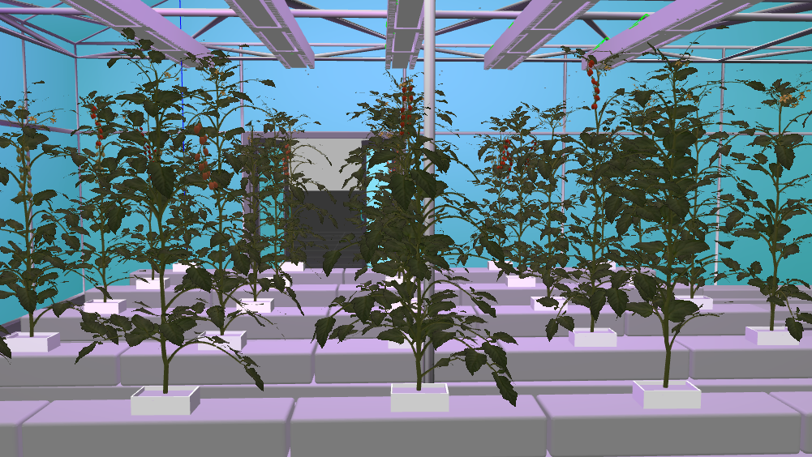

# Tomato Glass House Environment
This package is a tomato glass house simulator compatible with both Gazebo and Unity in ROS2 for ROS-based agricultural environment. This repository consists of three key parts  

1) Random tomato farm generator in Unity
2) Random tomato glass house generator in Gazebo
2) Simulation of the generated tomato farms in Unity and Gazebo

Gazebo 

 

<!-- 
-->

Unity

<!-- 
-->

 


# Attention!!!

**Follow instructions to build docker container to prepare environment**

https://github.com/LCAS/dogtooth_docker.git

## Getting Started (assume that you are inside the docker container)

```bash
mkdir -p /home/developer/dogtooth_ws/src 
cd /home/developer/dogtooth_ws/src
git clone --branch humble-dev git@github.com:LCAS/aoc_tomato_farm.git
cd aoc_tomato_farm && git checkout humble-dev
cd /home/developer/dogtooth_ws && colcon build
source ~/.bashrc
```

# How to Generate a New Glass house Tomato Farm in Gazebo

Run Jupyter Notebook

```bash
cd /home/developer/dogtooth_ws/src/aoc_tomato_farm/tomato_farm_generator/scripts/
jupyter notebook glass_house_generator.ipynb
```

In this file, the farm size, the number of rows, the number of plants in each row, the distance between each plant and each row, the quantity of glass houses and the attenuation of the lights can be parametrically adjusted. Each plant in the farm is generated randomly, including locations of stems, leaves, fruits and so on. The generated tomato farm tomato models and world files, both compatible with Gazebo Sim and Gazebo Classic are saved in **tomato_farm_generator/generated** folder. 

# How to Use Generated Tomato Farms in Simulation

To use a generated tomato farm in simulation, copy files in **tomato_farm_generator/generated** folder into **tomato_farm_simulator/models** and **tomato_farm_simulator/worlds** folders and modify launch file (tomato_farm_world.launch.py) accordingly.

## Run Gazebo Simulation

Run the following launch file to simulate only Gazebo tomato farm world

```bash
ros2 launch tomato_farm_simulator tomato_farm_world.launch.py
```

If you do not want to use lights in your gazebo simulation, before generate your new environment go to **gz_tomato_farm_generator/templates/lamp_model_gazebo_classic_and_sim/{{cookiecutter.models}}/{{cookiecutter.world_name}}/{{cookiecutter.lamp_name/model.sdf}}** and comment the next lines
```bash
<light name='lightComponent' type='point'>
    <diffuse>0.37 0.203 0.513 1</diffuse>
    <specular>0.1 0.1 0.1 1</specular>
    <attenuation>
        <range>7</range>
        <constant>{{cookiecutter.light_constant}}</constant>     
        <linear>{{cookiecutter.light_linear}}</linear>
        <quadratic>{{cookiecutter.light_quadratic}}</quadratic>
    </attenuation>
    <cast_shadows>1</cast_shadows>
    <direction>0 0 -1</direction>
</light>

```

# Glass house model

if you want to use the glass house model of the pictures, you can buy it here: https://www.cgtrader.com/3d-models/architectural/other/hydroponic-greenhouse
