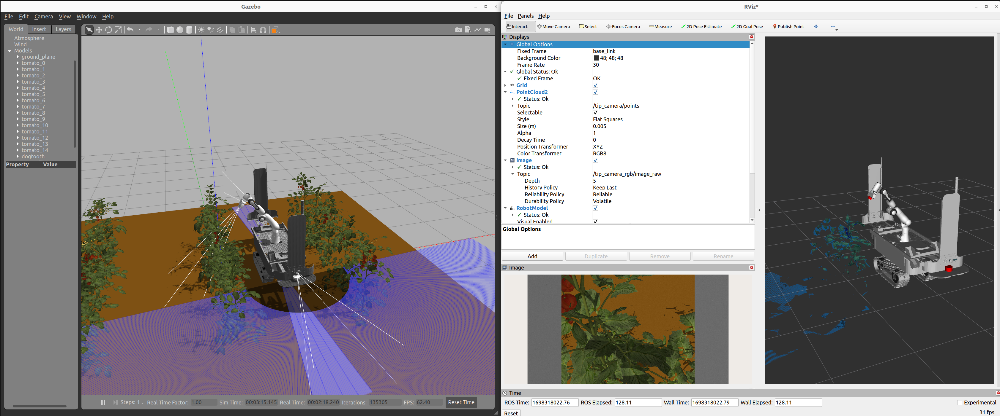

# Tomato Farm Environment
This package is a tomato farm simulator compatible with both Gazebo Sim and Gazebo Classic in ROS2 for ROS-based agricultural environments. This repository consists of four key parts

1) Random tomato farm generator
2) Simulation of the generated tomato farms in Gazebo Classic and Gazebo Sim

Gazebo Classic 

 

<!-- 
-->

Gazebo Sim

<!-- 
-->

 

# How to Generate and Use New Tomato Farm

Run Jupyter Notebook

```bash
jupyter notebook tomato_gen_Gazebo_Sim_and_Classic.ipyn
```

In this file, the farm size, the number of rows, the number of plants in each row, the distance between each plant and each row can be parametrically adjusted. Each plant in the farm is generated randomly, including locations of stems, leaves, fruits and so on. The generated tomato farm tomato models and world files, both compatible with Gazebo Sim and Gazebo Classic are saved in **gazebo_tomato_farm_generator/generated** folder. 

To use generated tomato farm in simulation, copy files in **gazebo_tomato_farm_generator/generated** folder into **aoc_tomato_farm_gazebo/models** and **aoc_tomato_farm_gazebo/worlds** folders and modify launch file (tomato_farm_world_mobile_manipulator_001.launch.py) accordingly.

# Run Gazebo Simulation

Run the following launch file to simulate only Gazebo tomato farm world

```bash
ros2 launch aoc_tomato_farm_gazebo tomato_farm_world.launch.py
```

Run the following launch file to simulate mobile manipulator in Gazebo tomato farm world

```bash
ros2 launch aoc_tomato_farm_gazebo tomato_farm_world_mobile_manipulator_001.launch.py 
```

PS: Adjust parameters in **mobile_manipulator_001.urdf.xacro** file in **dogtooth/dogtooth_description/urdf** folder  

* spawn_manipulator: true/false -> To spawn Franka Arm
* spawn_mobile_robot: true/false -> To spawn Dogtooth Mobile Robot
* If both are true, mobile manipulator is spawn (Dogtooth Mobile Robot equipped with Franka Arm)

To control the mobile platform 

```bash
ros2 run teleop_twist_keyboard teleop_twist_keyboard
```

To control the robot arm

```bash
ros2 run franka controller -1.57 +0.67 0 0 0 1.3 -2.3 0
```



# Environment Template
1) Placeholders for specific map files
2) Generators to construct missing map files
3) Procedural generation tools for robustness evaluation maps
4) Compilation setups to make map file references easier

# Public Environment
To create a publically available environment, create a new branch on a fork of the repository. A PR can be used to include your public environment into the upstream here

# Private Environment
Some environments may be requested by owners to be kept private. If this is the case, you can create your own repository using the `Use This Template` button, then set your new respository to private. Please note: it is advised you only do this if you must. Pulling updates from a template's source can become tedious and may create problems for your workflow

